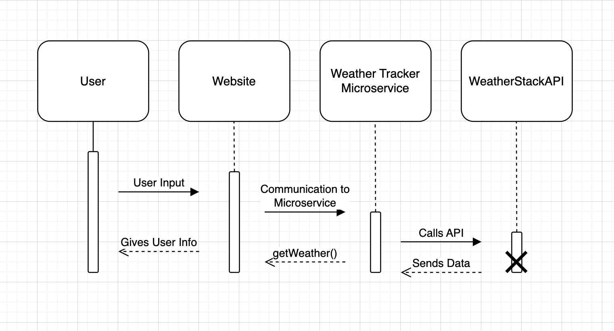

## A. How to Request for Data 
    Simply input a city or zipcode to request for data from the API.
    
    An example call would look like this
    City: Corvallis
    or
    Zipcode: 97331

## B. How to Recieve Data
    After the microservices is able to verify and successfully recieve the request. The data will then be sent to the webpage showing the weather data in real time. 
    
## UML Sequence Diagram

